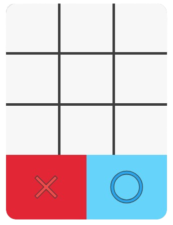
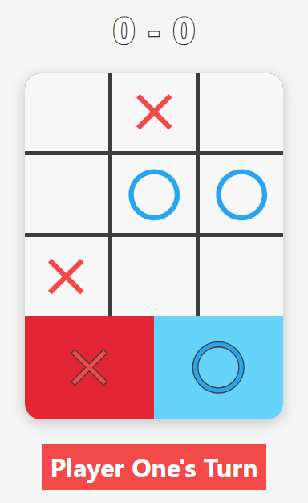

# Tic-Tac-Toe Game

A simple Tic-Tac-Toe game implemented using HTML, CSS, and JavaScript. 
https://abdullahhatim.github.io/Project-Tic-Tac-Toe-TOP/

## How to Play

1.  Head to the link Above 👆
2.  The game is ready to play directly in your browser. The game starts with "Player One's Turn". Player One uses the 'X' marker, and Player Two uses the 'O' marker.
3.  Click on any empty cell on the game board to place your marker.
4.  Turns will automatically alternate after each move.
5.  The game will detect if a player wins (by getting three markers in a row horizontally, vertically, or diagonally) or if it's a draw (when all cells are filled and no one has won).
6.  The score of the winning player will be increased automatically.
7.  To reset the game board without resetting the scores, click on the board after a game has ended.
8.  To adjust player names or completely reset the game, including scores, use the settings icon (cog icon) located in the bottom right corner of the game interface.

## Features

*   **Interactive UI:** Play Tic-Tac-Toe in your browser with a user-friendly interface.
*   **Two Players:** Supports two players to compete against each other.
*   **Score Keeping:** Tracks and displays the scores for Player One and Player Two.
*   **Customizable Player Names:** Allows players to set their names via the settings menu.
*   **Game Reset:** Option to reset the game board and scores through the settings menu.
*   **Visual Turn Indicator:** Clearly indicates whose turn it is.
*   **Win/Draw Detection:** Automatically detects and announces wins and draws.

## Project Time
Console Version: 6 hours. 
Total project time: 16:00 hours.

## Side Note

I was away for a week during the project, which may have affected the development timeline.
